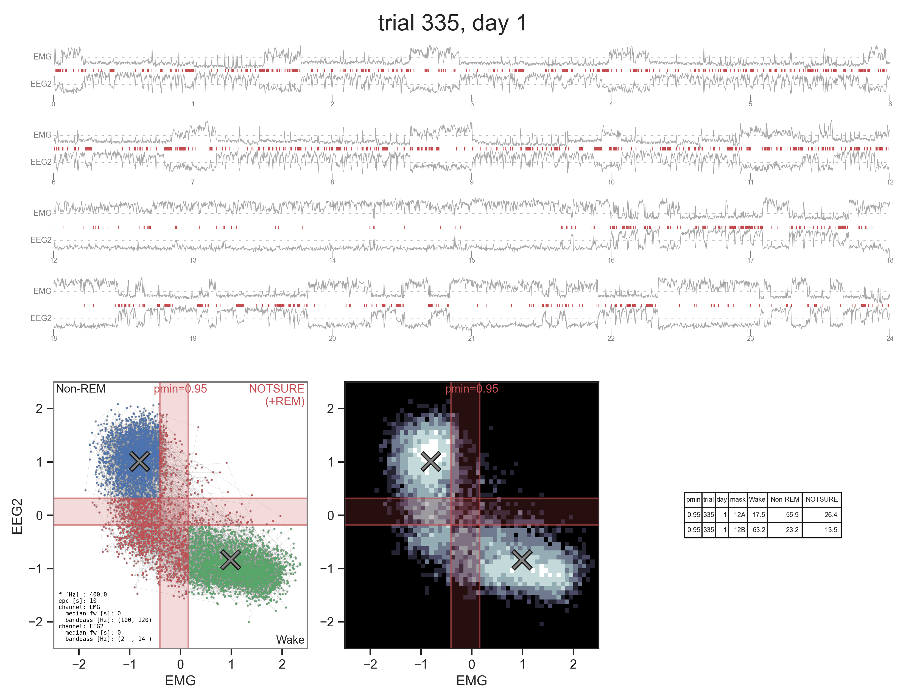

# sleep-classifier

This repo implements a scheme to assign sleep states for mice undergoing simultaneous EEG and EMG recording. An unsupervised classifier uses two features, EMG and EEG rms power, to make conservative predictions of Non REM and Wake epochs, and defers the more challenging epochs, including REM, to manual scoring.



# installation
It is recommended to use a virtual environment of some sort (e.g. conda, anaconda) instead of installing directly to your system. With your environment set up, you can clone this repo and install it via

```
# command line (linux/Mac)
git clone git@github.com:focolab/sleep-classifier.git
cd sleep-classifier     # enter the folder
pip install -e .       # -e allows you to edit (hack arond with) the library
```

# demo
The jupyter notebook in the demo folder is the best place to get started.

